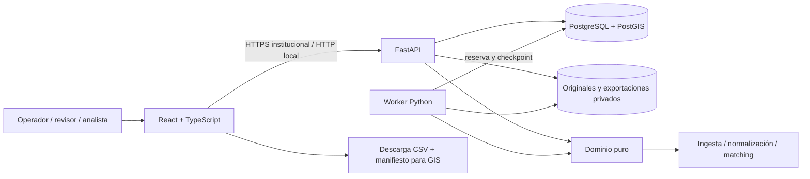

# Arquitectura del MVP

## Decisión principal

Un backend modular comparte dominio entre la API y un worker independiente. La base de datos mantiene tanto el estado de negocio como la cola durable. La aplicación web consulta el estado y presenta las decisiones; no ejecuta geocodificación en el navegador.

El despliegue tiene tres procesos de aplicación: frontend, API y worker. PostgreSQL/PostGIS es la persistencia compartida. SQLite permite desarrollo sin servicios adicionales, con un solo worker. Los originales y las exportaciones se guardan fuera del servidor estático; descargarlos requiere autorización de la API.

## Módulos y dependencias

| Capa | Responsabilidad | Restricción |
| --- | --- | --- |
| Dominio | Lectura por filas, extracción de componentes, reglas de coordenadas y matching | No depende de FastAPI ni de la base de datos |
| API | Autenticación, permisos, validación, operaciones, consultas y revisión | El trabajo masivo queda en el worker |
| Persistencia | Usuarios, cargas, filas, unidades, resultados, revisiones, cola y auditoría | Restricciones y transacciones conservan trazabilidad |
| Worker | Ingesta, matching y exportaciones con estado persistido | Procesa identidades de trabajos; no depende del navegador |
| Frontend | Flujo de carga, progreso, resultados, revisión, referencias y exportaciones | Muestra datos reales de API; no inventa resultados |
| Infraestructura | PostgreSQL local, procesos supervisados, salud, almacenamiento, scripts Bash y CI | Instalación directa en la computadora |

La entrada `geopol/main.py` compone FastAPI, CORS, cabeceras de seguridad y registro de routers. Las rutas se agrupan en `geopol/api/` por responsabilidad:

| Módulo | Responsabilidad HTTP |
| --- | --- |
| `auth.py` | Inicio/cierre de sesión y usuario actual |
| `uploads.py` | Carga por bloques, perfil, cierre y descarga autorizada del original |
| `runs.py` | Creación, consulta, cancelación, reintento, reproceso y listado de resultados |
| `review.py` | Bandeja, detalle, reserva y decisiones con control de versión |
| `references.py` | Consulta e importación de catálogos versionados |
| `exports.py` | Instantáneas, estado, manifiesto y descarga de exportaciones |
| `system.py` | Salud, dashboard, reglas y auditoría |
| `common.py` | Dependencias de roles, comprobación de acceso, paginación y filtros compartidos |

Los routers dependen de los servicios, modelos y dominio compartidos, sin importar la aplicación `main` ni otros routers. Las sesiones se inyectan mediante `get_db`, incluida la comprobación de salud. Esto permite probar HTTP con una base aislada y mantener los contratos estables al reorganizar módulos.

## Flujo de datos

1. La API registra la carga y recibe bloques con posición explícita. Al completarla, verifica tamaño y calcula SHA-256. El perfil inspecciona un subconjunto acotado.
2. Una ejecución fija configuración, mapeo, referencia y versión de reglas. Crear el trabajo persiste la solicitud; el worker la recoge sin necesitar una conexión del navegador.
3. La ingesta conserva cada fila y separa las incidencias. Filas de una misma denuncia y ubicación pueden compartir una unidad; una denuncia con ubicaciones distintas conserva varias unidades.
4. La normalización preserva texto original, transformaciones, componentes, advertencias y campos legados. El par original, el punto heredado y una propuesta de referencia se tratan como evidencias diferentes.
5. El motor busca dentro del territorio y la versión elegidos. Devuelve método, precisión, resolución, candidatos e intentos. La similitud textual sirve para ordenar candidatos y no equivale a probabilidad de acierto.
6. La revisión requiere reservar el resultado y enviar su revisión esperada. El servidor rechaza una decisión obsoleta con conflicto; registrar motivo y evidencia forma parte de la operación.
7. La exportación fija un corte de resultados y escribe CSV y manifiesto. Los casos sin punto permanecen representados con coordenadas vacías.

`review_workflow.py` clasifica el trabajo pendiente sin cambiar la resolución geográfica. `review_status` distingue abierto/finalizado y `review_bucket` identifica la acción necesaria. Worker, migración y decisiones HTTP utilizan el mismo clasificador. La última acción `reopen` conserva la historia manual y vuelve a abrir la tarea. La selección del siguiente caso es una consulta; reservarlo sigue siendo una acción explícita.

Las ejecuciones guardan `parent_run_id` y `superseded_by`. El worker publica al sucesor y sustituye al anterior en la misma transacción de finalización correcta. Un fallo mantiene vigente al padre. Los resultados y revisiones anteriores permanecen consultables; las bandejas operativas excluyen las versiones sustituidas. Véase el [flujo completo](review-workflow.md).

## Cola y recuperación

La cola en SQL evita agregar un broker en este MVP. Los trabajos, reservas y checkpoints sobreviven a la caída del proceso. Los reintentos deben seguir identificadores y restricciones de unicidad para no duplicar filas, unidades ni revisiones. Las reservas vencidas permiten recuperar trabajo abandonado.

Esta elección simplifica la operación inicial y conserva la separación API/worker. No equivale a una validación de throughput nacional. Un despliegue con varios workers exige PostgreSQL y pruebas de concurrencia/fallos sobre el entorno objetivo. El cambio a Celery/RabbitMQ sería una decisión posterior basada en capacidad, manteniendo los mismos contratos y controles de idempotencia.

## Referencias espaciales

Las referencias se importan como versiones explícitas de CSV o GeoJSON; cada ejecución conserva su referencia. No se obtiene cartografía desde Internet. El MVP consulta subconjuntos territoriales acotados de la referencia y utiliza operaciones Shapely. La migración PostgreSQL añade geometrías derivadas y sus índices GiST, además de un índice textual trigram, como base para ampliar las consultas. El matching todavía no utiliza búsqueda masiva nativa PostGIS ni transformación automática de CRS; acepta EPSG:4326.

Una frontera sintética permite ensayar validación territorial en las pruebas, pero no acredita un límite oficial. Sin una referencia verificable, el sistema se abstiene o pide revisión. Los catálogos oficiales requieren identificación, cobertura, vigencia, licencia, CRS y validación institucional.

## Evolución prevista

- Mantener migraciones incrementales con preservación de datos; v2 incorpora estado de revisión y linaje, con backfill por bloques.
- Reemplazar el catálogo en memoria por índices espaciales y consultas PostGIS cuando lo exija su volumen.
- Añadir proveedor OIDC, autorización territorial y políticas de retención acordadas.
- Incorporar almacenamiento institucional, observabilidad y pruebas de recuperación y capacidad.
- Mantener el GIS institucional como consumidor del producto exportado.

Estas extensiones no cambian el principio de conservar origen, versión y evidencia de cada decisión.
